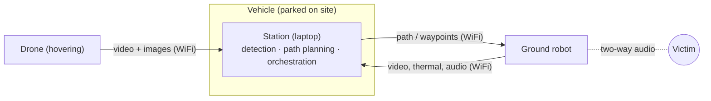

# Agentic Aerial-Ground Robot Collaboration for Victim Detection and Triage

> **Status:** Draft · **Updated:** 2026-10-04

CSCI 408 senior project (Group 19). A vehicle carrying a laptop **station**, a **drone** and a **ground robot** drives to a spot where victims are likely to be after an earthquake. The drone hovers and streams video to the station, which detects and tags victims, plans a path, and sends the robot to verify the victim's status and talk to them.

## System at a glance

## Repository map

| Path                                   | Purpose                                                   |
| -------------------------------------- | --------------------------------------------------------- |
| [docs/](docs/)                         | Overview, assumptions, architecture, interfaces, glossary |
| [station/](station/)                   | Station: detection, path planning, orchestration          |
| [drone/](drone/)                       | Drone: hovering sensing platform                          |
| [ground-robot/](ground-robot/)         | Ground robot and Robotics team collaboration              |
| [literature/](literature/)             | Reading list, BibTeX, datasets, paper notes               |
| [meeting-notes/](meeting-notes/)       | All meetings (supervisors, Robotics team, internal)       |
| [templates/](templates/)               | Templates for recurring files                             |
| [paper/](paper/)                       | Final report (LaTeX)                                      |
| [src/](src/)                           | Source code                                               |
| [open-questions.md](open-questions.md) | Open and resolved questions                               |
| [CHANGELOG.md](CHANGELOG.md)           | Decisions and changes, newest first                       |

## Status

- [x] Initial architecure decided – stationary drone, tumblweed robot deployed at site, station as orchestrator
- [ ] Concept of operations agreed by the team
- [ ] Station–robot interface agreed with the Robotics team
- [ ] Datasets selected
- [ ] Detection baseline running
- [ ] End-to-end demo (simulated or recorded data)
- [ ] Final report

## Contacts

### Team

| Name                 | Email                          | Role |
| -------------------- | ------------------------------ | ---- |
| Askar Matayev        | askar.matayev@nu.edu.kz        | -    |
| Ruslan Nagimov       | ruslan.nagimov@nu.edu.kz       | -    |
| Yelzhan Rakhimzhanov | yelzhan.rakhimzhanov@nu.edu.kz | -    |
| Bakhtiyar Yesbolsyn  | bakhtiyar.yesbolsyn@nu.edu.kz  | -    |
| Nurbek Baktygali     | nurbek.baktygali@nu.edu.kz     | -    |

### Supervisors

| Name         | Email                   | Role            |
| ------------ | ----------------------- | --------------- |
| Adnan Yazici | adnan.yazici@nu.edu.kz  | Main Supervisor |
| Enver Ever   | enverevermetu@gmail.com | Supervisor      |
| M            | -                       | Supervisor      |

### Robotics team

| Name              | Email                       | Role       |
| ----------------- | --------------------------- | ---------- |
| Gourav Devappa    | gourav.devappa@nu.edu.kz    | Supervisor |
| Mirat Serik       | mirat.serik@nu.edu.kz       | -          |
| Adil Ismagambetov | adil.ismagambetov@nu.edu.kz | -          |
| Yevgeniy Dikun    | yevgeniy.dikun@nu.edu.kz    | -          |

<strong>Conventions</strong>

- Every Markdown doc starts with a title and a status line: `> **Status:** Draft | In review | Agreed · **Updated:** YYYY-MM-DD`.
- Dates use ISO format (`YYYY-MM-DD`). File names use `kebab-case`.
- Record every decision or change in [CHANGELOG.md](CHANGELOG.md), including its rationale.
- Add unresolved questions to the **Open** section of [open-questions.md](open-questions.md). Once answered, move them to **Resolved** and log the answer in the changelog.
- Recurring files (meeting notes, literature notes) start from [templates/](templates/).
- Cite only keys that exist in [literature/references.bib](literature/references.bib).
- Do not copy the Robotics team's internals. Link to their docs and record dated facts in [ground-robot/](ground-robot/).

