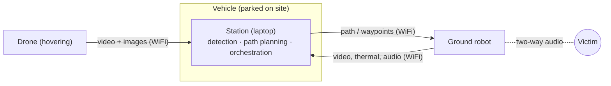

# Agentic Aerial-Ground Robot Collaboration for Victim Detection and Triage

> **Status:** Draft · **Updated:** 2026-10-04

CSCI 408 senior project (Group 19). A vehicle carrying a laptop **station**, a **drone** and a **ground robot** drives to a spot where victims are likely to be after an earthquake. The drone hovers and streams video to the station, which detects and tags victims, plans a path, and sends the robot to verify the victim's status and talk to them.

> [!NOTE]
> The original 2025 proposal is outdated. The project now uses a stationary drone with all computation on the station. See [CHANGELOG.md](CHANGELOG.md).

## System at a glance

## Repository map

| Path | Purpose |
| --- | --- |
| [docs/](docs/) | Overview, assumptions, architecture, interfaces, glossary |
| [station/](station/) | Station: detection, path planning, orchestration |
| [drone/](drone/) | Drone: hovering sensing platform |
| [ground-robot/](ground-robot/) | Ground robot and Robotics team collaboration |
| [literature/](literature/) | Reading list, BibTeX, datasets, paper notes |
| [meeting-notes/](meeting-notes/) | All meetings (supervisors, Robotics team, internal) |
| [templates/](templates/) | Templates for recurring files |
| [paper/](paper/) | Final report (LaTeX) |
| [src/](src/) | Source code |
| [open-questions.md](open-questions.md) | Open and resolved questions |
| [CHANGELOG.md](CHANGELOG.md) | Decisions and changes, newest first |

## Status

- [x] Pivot defined (stationary drone, station as orchestrator)
- [ ] Concept of operations agreed by the team
- [ ] Station–robot interface agreed with the Robotics team
- [ ] Datasets selected
- [ ] Detection baseline running
- [ ] End-to-end demo (simulated or recorded data)
- [ ] Final report

## Team

| Name | Role |
| --- | --- |
| Askar Matayev | TBD |
| Ruslan Nagimov | TBD |
| Yelzhan Rakhimzhanov | TBD |
| Bakhtiyar Yesbolsyn | TBD |
| Nurbek Baktygali | TBD |
| Supervisors | TBD |
| Robotics team contact | TBD |

<strong>Conventions</strong>

- Every Markdown doc starts with a title and a status line: `> **Status:** Draft | In review | Agreed · **Updated:** YYYY-MM-DD`.
- Dates use ISO format (`YYYY-MM-DD`). File names use `kebab-case`.
- Record every decision or change in [CHANGELOG.md](CHANGELOG.md), including its rationale.
- Add unresolved questions to the **Open** section of [open-questions.md](open-questions.md). Once answered, move them to **Resolved** and log the answer in the changelog.
- Recurring files (meeting notes, literature notes) start from [templates/](templates/).
- Cite only keys that exist in [literature/references.bib](literature/references.bib).
- Do not copy the Robotics team's internals. Link to their docs and record dated facts in [ground-robot/](ground-robot/).

