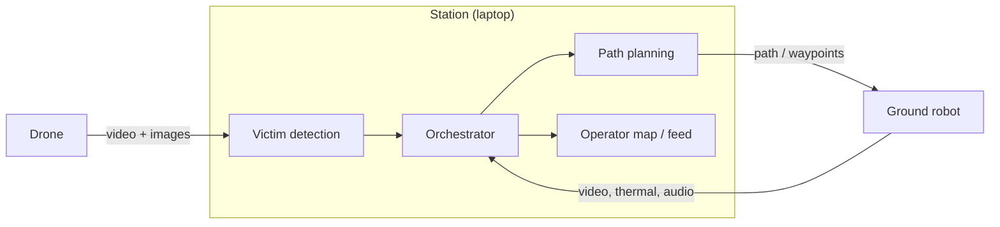

# Architecture

> **Status:** Draft · **Updated:** 2026-10-04

## Components

| Component | Responsibilities | Details |
| --- | --- | --- |
| Station | All computation: detection, path planning, orchestration, operator UI | [station/](../station/) |
| Drone | Hover, sense, stream | [drone/](../drone/) |
| Ground robot | Follow the path, verify the victim, communicate | [ground-robot/](../ground-robot/) |

## Data flow

1. Drone → station: video and images.
2. Station: detect and tag the victim, then plan the robot path.
3. Station → robot: path / waypoints.
4. Robot → station: video, thermal and audio.
5. Station → rescue team: victim location and status.

All links are shown in [interfaces.md](interfaces.md).
