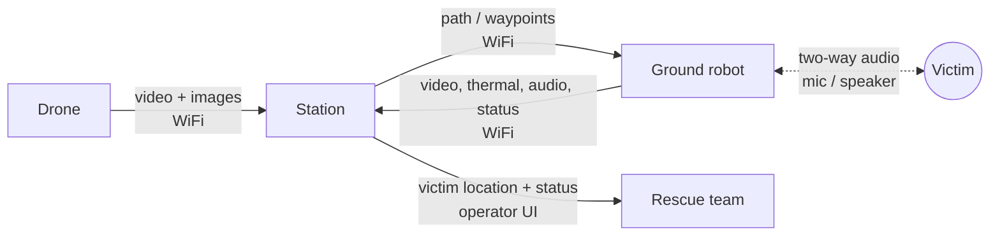

# Interfaces

> **Status:** Draft · **Updated:** 2026-10-04

Every link between components in one diagram. Links involving the robot must be reviewed by the Robotics team. Rates and message formats are TBD.

## Agreed details

_Add notes on message format, rate, units and coordinate frame for each link once agreed._
