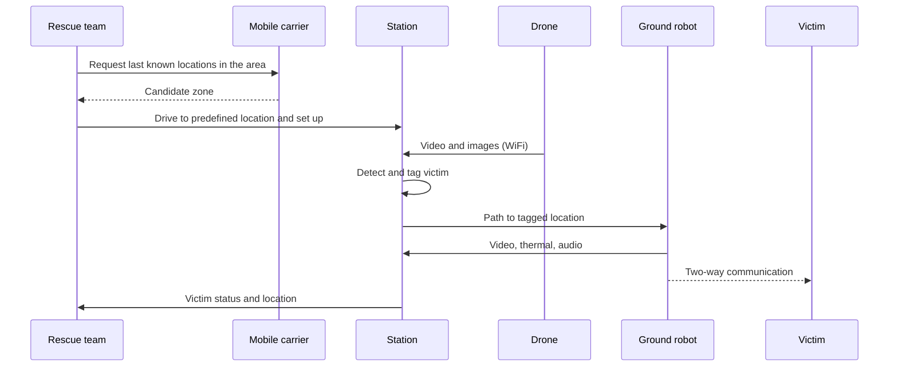

# Overview

> **Status:** Draft · **Updated:** 2026-10-04

## Problem

After an earthquake, rescuers must find and assess victims quickly, but roads, structures and communications are damaged. Sending humans into unassessed areas is dangerous and slow.

## Approach

A vehicle carries three devices: a laptop **station**, a **drone**, and a **ground robot**. The drone hovers at one point and streams video to the station. The station detects and tags victims, plans a path, and sends the robot to verify the victim's status and communicate with them. Triage categories follow the START scheme (see [glossary](glossary.md)).

## Concept of operations

1. **Pre-mission:** the team requests carrier location data and picks a site. See [assumptions](assumptions.md).
2. **Scene 1 (aerial):** the vehicle parks at the predefined location, the drone hovers and streams, and the station detects and tags a victim.
3. **Scene 2 (ground):** the station plans a path, the robot follows it, verifies the victim's status, and communicates with them.

## Scope

- [ ] Victim detection from drone imagery (RGB / thermal as available)
- [ ] Station-side path planning for the ground robot
- [ ] Station-side orchestration
- [ ] Robot-side verification (thermal, audio) and triage signals
- [ ] Evaluation against a baseline

**Out of scope:** robot locomotion and hardware design (Robotics team), carrier-side location services (assumed available).
